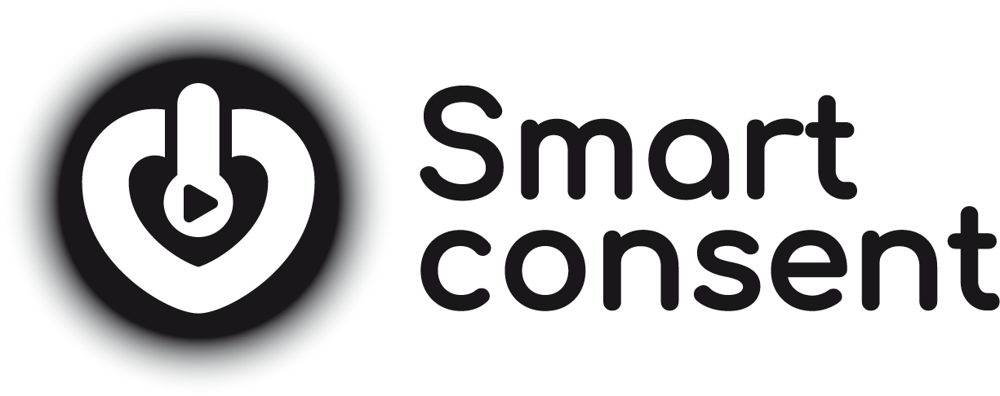
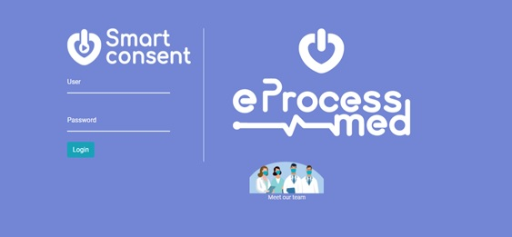
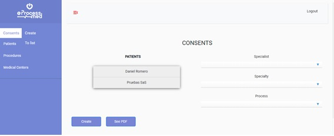
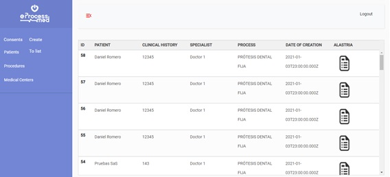
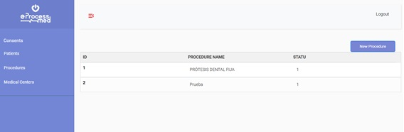
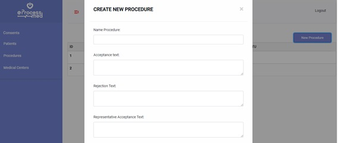
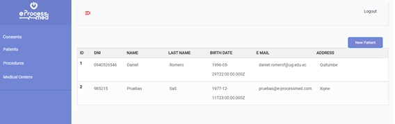
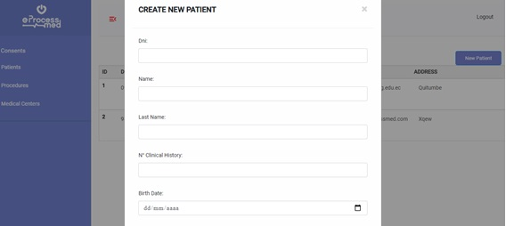
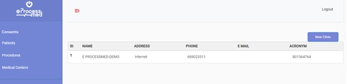
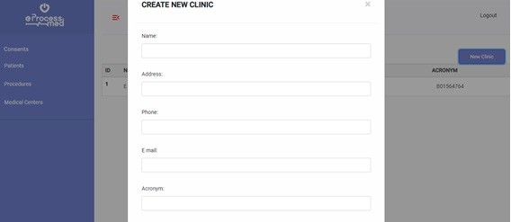

# The Smart Consent Project

eHealth startup focused exclusively on the digitization of medical processes, has technologically advanced the medical informed consent in security and communication.

## The Technology

Use of API-REST in express with Nodejs and Blockchain API Alastria. And Angular

###  Repository
 - [Repo-BF](https://github.com/LedgerProject/eprocessmed-smc-app)
 - In "smart-consent" is the new frontend structure 
 - In "api_df_middleware" is a business middle layer
 - In "api_df_back" contains the data models
 - In "apiblockchain" It contains an api that gives access 
   to the frontend to interact with the Alaska blockchain.

## Links

Application link: [E-processmed](https://e-processmed.com/)

**SMART CONSENT**

Login screen, access to the system, with user and password

Screen for the creation of consents, a list of registered patients is presented, the specialty of the doctor who accesses the system is selected, and the procedure with which the consent will be generated. When creating consent, a modal is shown with the data that will be sent to the block chain and be able to generate the hash of the record. In addition, it allows you to view the pdf with the consent generated.

It lists the consents generated by the specialist, it also shows a button that redirects to the Alastria registry that is generated when the consent is created.

Screen that lists the procedures loaded in the database, it also contains a Button that allows the creation of new procedures using a modal that allows the entry of information.

Screen that lists the patients loaded into the database, also contains a Button that allows the creation of new ones, using a modal that allows the entry of their respective data.

Screen that lists the patients loaded into the database, also contains a Button that allows the creation of new ones, using a modal that allows the entry of their respective data.
# BACKEND

# BlockChain
  API REST NodeJS  / 
  access to the Alastria blockchain

#Command
  npm run test
